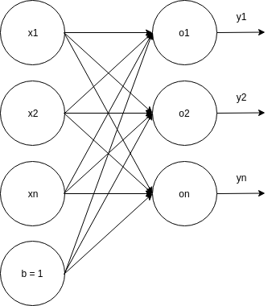

# Neural Intro

This document aim to present the basics of neural networks along with small examples and code samples to illustrate them. Nothing like *TensorFlow* or any existing *neural net frameworks* will be used to grasp the concept behind each network types. The code will be written *from scratch* using the less external dependencies as possible.

I'll not dive into an extensive introduction of what's a neural network and how it works, there is plenty of existing resources to get your hands on that.
But for the need of this presentation, let's define a basic neural network:

As shown above, this network:

- take some inputs (*xn* nodes)
- has a single layer of *neurons* (noted *on* above)
- produce as many outputs values as *on*'s neurons.

Still it can be even more simplified, that's what we'll see trying to solve a first problem in [Part 1 - The OR gate](part1/README.md).
