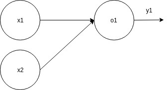

# Part 1 - The OR Gate

Let's start with the simplest form of Neural Network: a `single neuron`

## The neuron

A neuron can be represented as such:


As we can see above, a neuron has a set of **inputs** (*dendrites*), a **processor cell** (*soma*) and an **output cell** (*axon*).

Each **inputs** has its own weight. Plus an extra **bias input**, always equals to 1 (to make sure the neuron activates even when all inputs are zero). Then, the **processor cell** add all the inputs together, and multiply them by their own weights:


## To the logic gate

As a first example, we'll try to make a neuron able to solve a OR gate. As a reminder, OR gate is like this:

I1 | I2 | Output
--- | --- | ---
0| 0 | 0
0 | 1 | 1
1 | 0 | 1
1 | 1 | 1

Which can be visualized in a plan:


We'll want to classify the input pairs (called *features*) in 2 categories (called *labels*); the category of features outputting a 0, and the category of features outputting a 1.

By seeing the graph above, we can achieve this by separating the points by a line where:

 - (0,1), (1,0) and (1,1) are above it
 - (0,0) is below it

Which will correctly classify our features in the 2 expected categories.
This is the confirmation that a single neuron is able to solve this problem.
If we could not draw a single line to separate our data properly, more neurons would have been needed.

For (most of) us human this was an easy task as we can visualize the data, understand the problem, and *guess* a proper answer to it.
Now let's see how we can make our neuron do the same.

Let's first define our network structure:

 - 2 inputs
 - 1 output



So we have the following:

y = A((w1\*X1) + (w2\*X2) + (w3\*1))

From here, we want to define what should be this A function, and what are the values of w1, w2 and b such as:

For: | We want:
 --- | ---
x1 = 0 and x2 = 0 | A((w1\*x1) + (w2\*x2) + (w3\*1)) = 0
x1 = 1 and x2 = 0 | A((w1\*x1) + (w2\*x2) + (w3\*1)) = 1
x1 = 0 and x2 = 1 | A((w1\*x1) + (w2\*x2) + (w3\*1)) = 1
x1 = 1 and x2 = 1 | A((w1\*x1) + (w2\*x2) + (w3\*1)) = 1

so:

 - A((0\*w1) + (0\*w2) + (w3\*1)) = 0
 - A((1\*w1) + (0\*w2) + (w3\*1)) = 1
 - A((0\*w1) + (1\*w2) + (w3\*1)) = 1
 - A((1\*w1) + (1\*w2) + (w3\*1)) = 1

A() is called an **activation function**. Most popular ones can be found on [Wikipedia](https://en.wikipedia.org/wiki/Activation_function)
We could try few of them, but most common choice to get started is to pick the Logistic function (or *Sigmoid*).


Its role is to normalize its input between 0 and 1

Examples:
```
x=0 : 1/(1+e^-0)    = 1/(1+1)    = 0.5
x=1 : 1/(1+e^-1)    = 1/(1+0.36) = 0.73
x=2 : 1/(1+e^-2)    = 1/(1+0.13) = 0.88
x=-1: 1/(1+e^-(-1)) = 1/(1+2.71) = 0.26
x=-2: 1/(1+e^-(-2)) = 1/(1+7.38) = 0.11
```

So, let's apply this Sigmoid to our initial problem:

**for (0,0):**
```
A((0*w1) + (0*w2) + (w3*1)) = 0
A(w3) = 0
1 / (1 + e^-w3) = 0
```
we have: w3 must be << 0

**for (1,0):**
```
A((1*w1) + (0*w2) + (w3*1)) = 1
A(w1 + w3) = 1
1 / (1 + e^-(w1+w3)) = 1
```
we have: w1 >> 0 && w1 >> -w3

**for (0,1):**
```
A((0*w1) + (1*w2) + (w3*1)) = 1
A(w2 + w3) = 1
1 / (1 + e^-(w2+w3)) = 1
```
we have w2 >> 0 && w2 >> -w3

**for (1,1):**
```
A((1*w1) + (1*w2) + (w3*1)) = 1
A(w1 + w2 + w3) = 1
1 / (1 + e^-(w1 + w2 + w3)) = 1
```
this works with above rules.

We now have the **constraints** that must be fullfilled by `w1`, `w2` and `w3` to give the expected output.

Let's try it, and take arbitrary values matching theses, like:
```
w1 = 400
w2 = 600
w3 = -100
```

So we have :

```
(0,0) -> 1 / (1 + e^-(-100))               -> 0.00000...
(1,0) -> 1 / (1 + e^-(400 + (-100)))       -> 0.99999...
(0,1) -> 1 / (1 + e^-(600 + (-100)))       -> 0.99999...
(1,1) -> 1 / (1 + e^-(400 + 600 + (-100))) -> 0.99999...
```

This seems to work !

Let's draw this line on the first plot to see how it looks. We can get the line equation by resolving:
```
w1*x1 + w2*x2 + (w3*1) = 0
400*x1 + 600*x2 - 100 = 0
400*x1 + 600*x2 = 100
4/6*x1 + x2 = 1/6
x2 = -4/6*x1 + 1/6
```

And this gives:


As you can notice, this is just one of the many possible solutions to this problem. There is an infinity of other lines responding to the problem correctly.

Finally, let's implement that.

## Implementation in go

We start by defining a type for our neuron:

```go
type Neuron struct {
	Weight     []float64
	Bias       float64
	Activation func(float64) float64
}
```

And we instantiate it, with the values we calculated before:

```go
func main() {

	p := &Neuron{
		Weight: []float64{400.0, 600.0, -100.0},
		Activation: func(x float64) float64 {
			return 1.0 / (1.0 + math.Exp(-x))
		},
	}
}
```

Then, we want to create a new function, taking the input data, and returning an output like so:

```go
out := p.Predict(0.0, 1.0, 1.0) // I1, I2 and B
```

And finally the Predict function, where we sum all the inputs multiplied by their weights, and give this to the activation function:

```go

func (p Neuron) Predict(I1, I2, B float64) float64 {

	var output float64

	for i, input := range []float64{I1, I2, B} {
		output += p.Weight[i] * input
	}

	return p.Activation(output)
}

```

And voila ! Full source code can be seen [here](./or_gate.go), which print the predicted output for each possible inputs.

We get the following result:
```
 $ go run part1/or_gate.go
(0.000000,0.000000) = 0.000000
(1.000000,0.000000) = 1.000000
(0.000000,1.000000) = 1.000000
(1.000000,1.000000) = 1.000000
```

Next, in part 2, we'll see how the network can use **training** to learn by itself those w1, w2 and w3 values.

## Bonus

- Can the sigmoid function be replaced by anything else ?
- Can we make same for a AND gate ? a NAND ? a XOR ?
