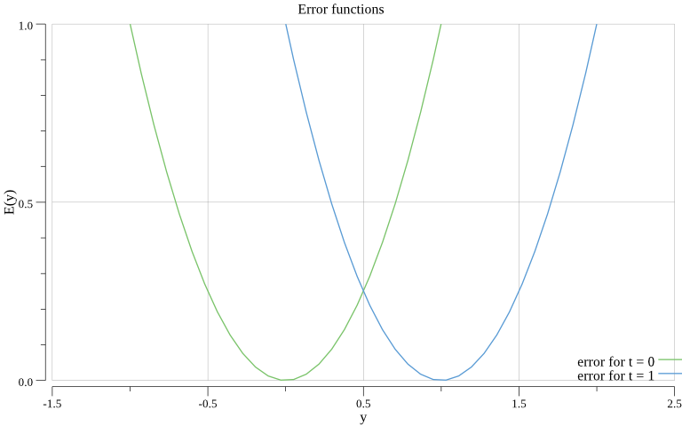
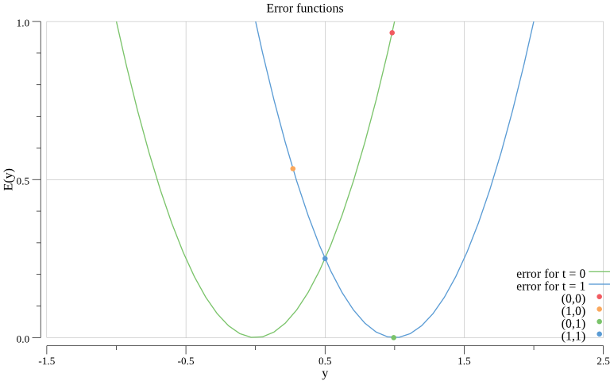

Previously, we calculated which values should have the weights to match our expectations and solve the OR gate.
This is quite ok to be done on such simple problems, but will soon become a mess as we try to solve harder problems, with more inputs or outputs.
So, we'll need a way to make our neural network to adjust itself to our problem. This is also known as **training**.

The idea here is to initialize the network with some random weights, and feed it with some already labeled inputs. So that we can calculate *how much wrong* is the network for each inputs.
From here, the network will be able to adjusts the weights so they will get the network output closer to the expected labels.

Let's get started.

## Theory

We remember from previous part the following expectations:
```
w3 must be << 0
w1 >> 0 && w1 >> -w3
w2 >> 0 && w2 >> -w3
```

That led us to choose the following weights that worked:
```
w1 = 400
w2 = 600
w3 = -100
```

But now let's pretend thoses weights have been randomly choosen, like so:
```
w1 = -5
w2 = 1
w3 = 4
```

This gives us the following *separation line*:

```
w1*x1 + w2*x2 + (w3*1) = 0
-5*x1 + 1*x2 + 4 = 0
x2 + 4 = 5*x1
x2 = 5*x1 - 4
```


By setting thoses weights to the previous example, we get the following output:
```
$ go run or_gate.go
(0.000000,0.000000) -> 0.982014 # expected 0
(1.000000,0.000000) -> 0.268941 # expected 1
(0.000000,1.000000) -> 0.993307 # expected 1
(1.000000,1.000000) -> 0.500000 # expected 1
```

So, only 1 out of 4 is correct.
Now we need to calculate by *how much* we're incorrect, and define a small change to apply on our weights so we get *better next time*. We want to slowly moves our actual weights toward new ones matching our initial expectations. For this, we'll use something called **[backpropagation](https://en.wikipedia.org/wiki/Backpropagation)**.

## Backpropagation

Let's start by calculating the **error** (or *loss*) of our network, with the help of a *[Loss function](https://en.wikipedia.org/wiki/Loss_functions_for_classification)*.
We have a few options to choose our error function, but let's just focus on one, the **square loss** function (this might not be the best choice for a classification problem, but let's just try).

The square loss function is defined as such:
```
E(y) = (t - y)^2

where:
 - t is the expected output (target)
 - y is the actual output of the network (y = A(w1*x1 + w2*x2 + w3*1))
```

As we have 2 output labels (t=0 and t=1), we can graph 2 error functions by expressing *E(y)*.

```
- t=0 -> E(y)=y^2
- t=1 -> E(y)=(y-1)^2
```



This gives us 2 curves, green one when we expect a 0 output, and blue one for 1.
From here, we can place our actual outputs on it:



- Green point, corresponding to (0,1) input, which is correct answer is at the bottom of the blue curve.
- Other points are wrong (*E(y) >> 0*), but on their respective curves.

Now the goal will be to adjust our weights, so each points slides slowly down to the minimum of the curve.
In other words, we want to minimize our error. The **[gradient descent](https://en.wikipedia.org/wiki/Gradient_descent)** will help us for that.

### Gradient

First, what's a **[gradient](https://en.wikipedia.org/wiki/Gradient)** ?
From wikipedia, the gradient *represents the slope of the tangent of the graph of the function*

Let's break that down:

 = 1/2 * x^2")

The tangent can be expressed in a given point *p* with:
```
y = f'(p) * (x - p) + f(p)
```

We can abstract it to something of the form:
```
y = a*x + b
```

This describe a line, where *a* is its slope, and *b* its y-intercept.

We can say now that *f'(p)* is the slope we're looking for. This is the **derivative** of our error function.

We can express it:

```
E(y) = (t - y)^2 # Reminder of our error function
E(y) = U(y)^2 with U(y) = (t - y)

E'(y) = 2 * U(y) * U'(y)
E'(y) = 2 * (t - y) * -1
E'(y) = -2 * (t - y)
```

So, this define the **contribution** of *y* in the network error. Now, what interest us is the contribution of each weights in the error, so we could know how to update them.
We must for that express our gradient in function of w1, w2 and w3. We have here 2 methods:

#### Calculus
```
E(y) = (t-y)^2

E(w1) = (t - A(w1*x1 + w2*x2 + w3)^2
E(w1) = U(w1)^2 with U(w1) = t - A(w1*x1 + w2*x2 + w3)
E'(w1) = 2 * U(w1) * U'(w1)
E'(w1) = 2 * (t - A(w1*x1 + w2*x2 + w3) * (0 - A'(V(w1))V'(w1)) with V(w1) = w1*x1 + w2*x2 + w3
E'(w1) = 2 * (t - A(w1*x1 + w2*x2 + w3) * -A'(w1*x1 + w2*x2 + w3) * x1
E'(w1) = -2 * (t - y) * A'(w1*x1 + w2*x2 + w3) * x1
E'(w1) = -2 * (t - y) * A(w1*x1 + w2*x2 + w3) * (1 - A(w1*x1 + w2*x2 + w3)) * x1
E'(w1) = -2 * (t - y) * y * (1 - y) * x1

So:
E'(w1) = -2 * (t - y) * y * (1 - y) * x1
E'(w2) = -2 * (t - y) * y * (1 - y) * x2
E'(w3) = -2 * (t - y) * y * (1 - y) * 1
```

Here, we have the **contribution of w1** to the network error. But yeah, this was quite a pain to get there, and much likely error prone. Alternativly, we can use the [chain rule](https://en.wikipedia.org/wiki/Chain_rule) instead, that gives us same result but with less effort.

#### Chain rule

We can obtain same result as above a bit quicker. First let's remember our network diagram:


The chain rule allows us to *express the derivative of the composition of 2 or more functions*.
we can write it like so:


Which we can then expand with what we know.

Last member dS/dw1:

```
We had:
S = w1*x1 + w2*x2 + w3*1

So:
dS/dw1 = 1*x1 + 0 + 0
dS/dw1 = x1

This gives:
dS/dw2 = x2
dS/dw3 = 1
```

Second member dy/dS:

```
We had:
y = A(S)

So:
dy/dS = A'(S) where A is a Sigmoid and it derivate as: A'(S) = A(S) * (1 - A(S))

This gives:
dy/dS = y * (1 - y)
```

First member dE/dy:

```
We had:
E(y) = (t - y)^2

So:
dE/dy = E'(y) which we have calculated above
dE/dy = -2 * (t - y)
```

So we can replace:

```
dE/dw1 = -2 * (t - y) * (y * (1 - y)) * x1

And for the others:
dE/dw2 = -2 * (t - y) * (y * (1 - y)) * x2
dE/dw3 = -2 * (t - y) * (y * (1 - y)) * 1
```

As we can see, both methods lead to the same results. We now have expressed the contribution of each weights to the global error.

### Descent & Backpropagation

Now that we have a gradient expression, we can calculate by how much we need to update our weights given a network output. Then, as we want to **descend** toward the minimum of the error, we'll need to substract it from our weights. But, we want also to take **small steps** doing that, as fully substracting the gradient from the weight may overshoot the minimum and make the network unable to reach it.

This step size is usually defined by the **learning rate** of a neural network. Which is a constant defined to a small value (like 0.1) which will get multiplied to our gradient to apply only 10% of it, in our example.

The number of steps we'll take is commonly defined as a number of **epochs**. Which is simply the number of times we'll feed a fixed input set to the network and perform weights adjustment based on the output.

Let's use some pseudo code here:
```
let w1 = rand()
let w2 = rand()
let w3 = rand()

for i=0; i<epochs; i++
	for each inputs (x1,x2,t)
		y = Predict(x1,x2)

		w1 = w1 - dE/dw1 * learningRate
		w2 = w2 - dE/dw2 * learningRate
		w3 = w3 - dE/dw3 * learningRate
	endfor
endfor
```

As we see, we're removing a fraction of each weight's gradient to their respective weights. Making them slowly produce a more accurate output on each epoch loops.

Now, how to define the learning rate and the epochs variables?

Learning rate:

- The smaller it gets, the most accurate the results will be.
- But will also increase the number of epochs needed to get to the minimum.
- If too big, you may overshoot the minimum and get stuck oscillating around it.

Epochs:

- As you get closer to the minimum, the weight update will become smaller and smaller.
- By monitoring your E'(...), you can know when it's not needed anymore.
- Alternativly, you can also define a minimum value for E' you consider as not relevant anymore (ie: 0.00001), and stop as soon as this minimum is reached.


## Implementation

Full source is available in [train.go](./train.go)

Let's start over our previous implementation made in part1 in [or_gate.go](../part1/or_gate.go)

First, we extend our Neuron with a new attribute:
```go
type Neuron struct {
	Weight               []float64
	Activation           func(float64) float64
	ActivationDerivative func(float64) float64
}
```

This ActivationDerivative function will provide the derivative of the sigmoid, so let's update the Neuron creation with it. We also set random values to init our weights:

```go
randSource := rand.NewSource(time.Now().UnixNano())
rng := rand.New(randSource)

p := &Neuron{
	Weight: []float64{rng.Float64(), rng.Float64(), rng.Float64()},
	Activation: func(x float64) float64 {
		return 1.0 / (1.0 + math.Exp(-x))
	},
	ActivationDerivative: func(y float64) float64 {
		return y * (1.0 - y)
	},
}
```

Now, before trying to predict the outputs, let's train the network. Since we have only 4 possible inputs, let's give them all.

```go
	p.Train(
		[][]float64{ // List of Inputs
			[]float64{0, 1},
			[]float64{1, 1},
			[]float64{1, 0},
			[]float64{0, 0},
		},
		[]float64{ // Expected outputs
			1,
			1,
			1,
			0,
		},
	)
```

Now this train function:

```go
func (p Neuron) Train(inputs [][]float64, expectedOutputs []float64) {

}

```

We take a list of inputs and a list of expected outputs as parameters.
As we saw earlier, let's first create our epochs loop and another loop over all inputs in it:

```go
func (p Neuron) Train(inputs [][]float64, expectedOutputs []float64) {

	epochs := 1000      // Number of times we'll process all given inputs

	for i := 0; i < epochs; i++ {
		for j, input := range inputs { // Loop on all inputs
			//...
		}
	}
}

```

Now the real work can start:

```go
func (p Neuron) Train(inputs [][]float64, expectedOutputs []float64) {

	epochs := 1000      // Number of times we'll process all given inputs

	for i := 0; i < epochs; i++ {
		for j, input := range inputs { // Loop on all inputs

			x1 := input[0]
			x2 := input[1]

			output := p.Predict(x1, x2)
		}
	}
}
```

We retrieve our current input set, and make the network predict an output.
And now, we compute the gradient:

```go
func (p Neuron) Train(inputs [][]float64, expectedOutputs []float64) {

	epochs := 1000      // Number of times we'll process all given inputs

	for i := 0; i < epochs; i++ {
		for j, input := range inputs { // Loop on all inputs

			x1 := input[0]
			x2 := input[1]

			output := p.Predict(x1, x2)

			currentError := -2 * (expectedOutputs[j] - output) // E'(y) = -2 * (t - y)
			slope := p.ActivationDerivative(output)            // A'(S) = y * (1 - y)

			x1Gradient := slope * currentError * x1            // dE/dw1 = -2 * (t - y) * (y * (1 - y)) * x1
			x2Gradient := slope * currentError * x2            // dE/dw2 = -2 * (t - y) * (y * (1 - y)) * x2
			bGradient := slope * currentError                  // dE/dw2 = -2 * (t - y) * (y * (1 - y))
		}
	}
}
```

And finally, update our weights:


```go
func (p Neuron) Train(inputs [][]float64, expectedOutputs []float64) {

	epochs := 1000      // Number of times we'll process all given inputs
	learningRate := 0.1 // The "speed" of the network to learn. Also seen as the length of the "jumps" the line will make between each epochs.

	for i := 0; i < epochs; i++ {
		for j, input := range inputs { // Loop on all inputs

			x1 := input[0]
			x2 := input[1]

			output := p.Predict(x1, x2)

			currentError := -2 * (expectedOutputs[j] - output) // E'(y) = -2 * (t - y)
			slope := p.ActivationDerivative(output)            // A'(S) = y * (1 - y)

			x1Gradient := slope * currentError * x1            // dE/dw1 = -2 * (t - y) * (y * (1 - y)) * x1
			x2Gradient := slope * currentError * x2            // dE/dw2 = -2 * (t - y) * (y * (1 - y)) * x2
			bGradient := slope * currentError                  // dE/dw2 = -2 * (t - y) * (y * (1 - y))

			p.Weight[0] = p.Weight[0] - x1Gradient*learningRate
			p.Weight[1] = p.Weight[1] - x2Gradient*learningRate
			p.Weight[2] = p.Weight[2] - bGradient*learningRate
		}
	}
}
```

And voila. By the end of the epochs loops, our network should have adjusted itself to our inputs, and can now give us some predictions.
(Okay not really impressive here, since we train on 4 inputs and use those same 4 to predict. But the concept is the same with bigger datasets)

```
$ go run train.go
(0.000000,0.000000) -> 0.138530
(1.000000,0.000000) -> 0.915070
(0.000000,1.000000) -> 0.915328
(1.000000,1.000000) -> 0.998621
```

We notice that we get slighly less accurate results than the first version where we calculated manually the numbers. This could mean we need more epochs and/or a smaller learning rate to refine the output. But for now, this is showing what we want if we considere as 0 everything below 0.2 and 1 everything above 0.8.

As extra, we can observe what's going on inside the network.


At initialization, we can see our separation line way under our point and not actually separating them much.
Also, the network prediction at this stage reflects pretty much that. Our 3 inputs expecting a 1 output are close to the minimum of the error function. But the one that expect a 0 is far away from it.
As epochs go, we can see the (0,0) input getting moved closer to the minimum, as well as the error line starting to move toward the points and finally crossing them, producing the expected results.

In part3, we'll finally move to the XOR gate problem, which was not solvable by our single neuron, and we'll get closer of having a network able to solve real life problems.
